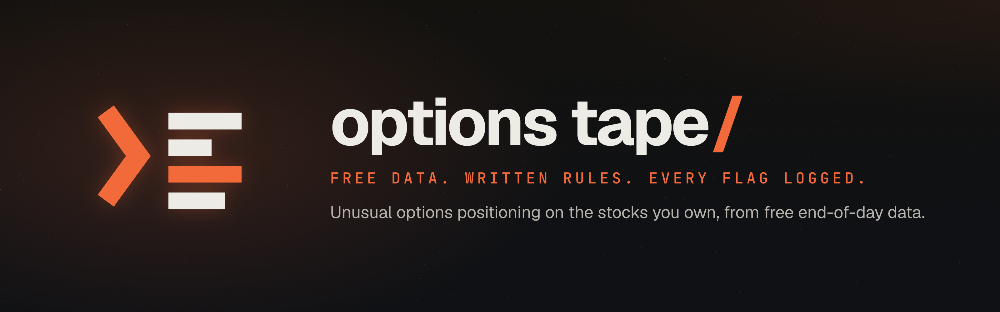

# Options tape for long-term investors

  <picture>
    <source media="(prefers-color-scheme: light)" srcset="assets/options-tape-readme-light.png">
    
  </picture>

  
  
  
  
  

[The edition](https://ai.shikshannivesh.com/p/i-do-not-trade-options-so-i-taught) · [Methodology](process/methodology.md) · [Evaluation plan](process/evaluation-plan.md) · [The skill](skill/SKILL.md) · [What changed in v2](#what-changed-in-v2-2026-09-23) · [GreekSoup](https://github.com/shubhamsborkar/greeksoup) · [Newsletter](https://ai.shikshannivesh.com)

A Claude Code workflow that reads US options positioning (free Cboe delayed data), insider Form 4 filings (SEC EDGAR) and House congressional trade disclosures for the names you own or follow, and surfaces **persistent series-level positioning anomalies**: option contracts where activity or open interest looks unusual against their own history.

It is a research prompt. It does not tell you what the options market thinks, and it never assigns a direction to a trade, because free end-of-day data cannot show who traded or which side they took. The limits are written out in `process/methodology.md`.

It was built and run live for an [Alpha with AI edition](https://ai.shikshannivesh.com/p/i-do-not-trade-options-so-i-taught).

## What changed in v2 (2026-09-23)

A reader pointed out that the v1 method claimed more than end-of-day data can support. They were right, and v2 fixes it:

- **Open interest.** v1 said unusual volume that did not show up in the next day's open interest was day trading, and volume that did show up was a position someone kept. That is wrong: one trader can close while another opens and leave open interest unchanged, and rising open interest does not say who opened the position or which side they hold. The tool no longer draws either conclusion.
- **Direction.** Put volume is not treated as bearish and call volume is not treated as bullish. Sold puts, covered calls, spreads, calendars, collars and rolls leave similar footprints.
- **Premium.** Thresholds now use the closing bid-ask midpoint instead of the last trade, and every candidate carries flags for a stale last trade, a last trade outside the quote, and wide markets.
- **Tags instead of exclusions.** Earnings, ex-dividend dates, corporate actions and adjusted contracts, index rebalances, hard-to-borrow conditions, expiration cycles and probable multi-leg trades are tagged and kept, so they can be evaluated separately.
- **A definition of "paid" written in advance.** `process/evaluation-plan.md` fixes the horizon, the outcome and a matched control before any result is measured. `scripts/evaluate.py` prints INSUFFICIENT DATA until the sample is large enough, and it is not yet.

The v1 reports and scan log in `outputs/` and `data/scan-log.md` are left exactly as they were written, as a record. Their "killed", "converted" and "paid" labels use the v1 reasoning described above.

## What is here

- `skill/SKILL.md`: the instruction file Claude Code follows on "run the tape"
- `scripts/`: config, daily snapshot, scan, evaluation, insider fetch, congressional fetch
- `process/methodology.md`: every signal, threshold, tag and limitation
- `process/evaluation-plan.md`: how a flag is judged, fixed in advance
- `data/snapshots/`: raw daily chain snapshots, so any number can be traced to the contract row it came from
- `data/flag-ledger.csv`: every flag the scan produces, with its tags and quality flags
- `data/events.csv`: dated events (earnings, ex-dividend, corporate actions, index rebalances, hard-to-borrow), each with its source
- `data/scan-log.md` and `outputs/`: the v1 run log and reports from the first two weeks

Snapshots cannot be backfilled. Your own archive starts the day you first run the snapshot script, so start early.

## Run it on the stocks you own

1. Put your own name and email in `scripts/config.py` (SEC EDGAR requires a real contact in the User-Agent).
2. Edit `UNIVERSE` in `scripts/config.py` to the names you own or genuinely follow. Ten to twenty works well.
3. Install the skill for Claude Code (copy `skill/SKILL.md` and `scripts/` into a `~/.claude/skills/options-tape/` folder), or open this repo in Claude Code and ask it to follow SKILL.md.
4. Say "run the tape" once a day after the US close.
5. Once you have a few months of snapshots, run `python3 scripts/scan.py --all` and then `python3 scripts/evaluate.py` to see how the flags have done against the plan.

## What it is not

It is not a trade-idea generator and it never recommends buying, selling or holding anything. A flagged contract is a question to research about a business you already know. Most days nothing clean shows up, and that is logged too.
